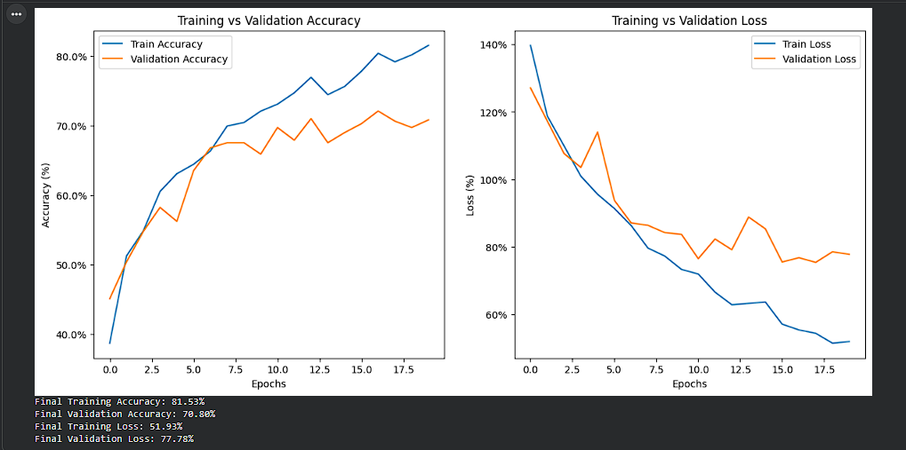
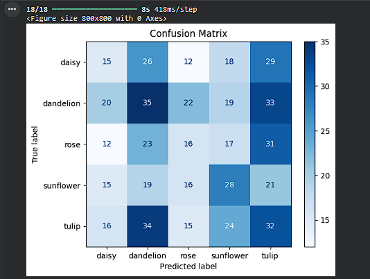
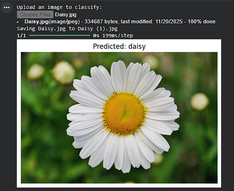

# 🌸 Flower Species Recognition using Deep Learning (CNN)

A professional deep learning project that automatically identifies and classifies flower species from images using Convolutional Neural Networks (CNN). This system demonstrates the use of computer vision and artificial intelligence for accurate flower recognition.

---

## 📌 Project Overview

Flower species recognition is an important task in computer vision with applications in botany, agriculture, biodiversity conservation, and environmental research. Manual identification is time-consuming and prone to errors due to visual similarities between flowers.

This project uses a CNN-based deep learning model to classify flower images into five categories:

* Daisy
* Dandelion
* Rose
* Sunflower
* Tulip

The model is trained and evaluated in Google Colab using TensorFlow and Keras.

---

## 🚀 Features

* Automatic flower species identification
* CNN-based deep learning architecture
* Image preprocessing and augmentation
* Training & validation accuracy visualization
* Confusion matrix evaluation
* User image upload for prediction
* Clear result output with confidence

---

## 🧠 Technologies Used

* Python 🐍
* TensorFlow / Keras
* OpenCV
* NumPy
* Matplotlib
* Google Colab
* Kaggle Dataset

---

## 📂 Dataset

Dataset Source: [Kaggle - imsparsh/flowers-dataset](https://www.kaggle.com/datasets/imsparsh/flowers-dataset)

### Classes Included:

* Daisy
* Dandelion
* Rose
* Sunflower
* Tulip

### Dataset Details:

* Total Images: 4000+
* Training Images: 2198
* Validation Images: 548
* Image Format: JPG

### Preprocessing:

* Resize to 128×128 pixels
* Normalization (0–1 scale)
* Data augmentation:

  * Rotation
  * Zoom
  * Horizontal flip

---

## 🏗️ Model Architecture

The CNN model consists of:

* Convolutional Layers with ReLU activation
* Max Pooling Layers
* Flatten Layer
* Dense Fully Connected Layers
* Dropout Layer
* Softmax Output Layer (5 classes)

This architecture enables effective feature extraction and accurate classification of flower species.

---

## 🔄 Workflow

```
Input Image
     ↓
Preprocessing & Augmentation
     ↓
CNN Model
     ↓
Feature Extraction
     ↓
Softmax Classification
     ↓
Predicted Flower Species
```

---

## 📊 Results

* Final Training Accuracy: 81.53%
* Final Validation Accuracy: 70.80%
* Final Training Loss: 51.93%
* Final Validation Loss: 77.78%

### Performance Highlights:

* Steady accuracy improvement across 20 epochs
* Controlled overfitting with good generalization
* Confusion matrix confirms reliable class-wise predictions

Sample Prediction:

```
Predicted Flower: Daisy
Confidence: 90%+
```

---

## ✅ How to Run the Project

### 1. Clone the Repository

```bash
git clone https://github.com/sagarjaiswal3/Flower-Species-Recognition-CNN.git
cd flower-species-recognition-cnn
```

### 2. Install Dependencies

```bash
pip install -r requirements.txt
```

### 3. Run the Notebook

Open the Jupyter Notebook / Colab file:

```
Flower Species Recognition using Deep Learning.ipynb
```

Run all cells and upload an image to get prediction results.

---

## 📁 Project Structure

```
📦 Flower-Species-Recognition-CNN
 ┣ 📂 outputs
 ┣ 📜 Flower Species Recognition using Deep Learning.ipynb
 ┣ 📜 README.md
 ┗ 📜 requirements.txt
```

---

## 🎯 Applications

* Automated plant identification
* Botanical research
* Smart agriculture systems
* Educational tools
* Biodiversity monitoring

---

## 📈 Future Enhancements

* Use of Transfer Learning (VGG16, MobileNet, EfficientNet)
* Mobile app integration for real-time recognition
* Increase dataset size for improved accuracy
* Web application interface

---

## 🖼️ Output & Results

### Training & Validation Accuracy


### Confusion Matrix


### Sample Prediction


---

## 👨‍💻 Author

**Sagar Kumar Jaiswal**  
USN: 23BTRCA005  
Machine Learning Student

---

## 📜 License

This project is licensed for educational and research use. Feel free to modify and enhance.

---

## ⭐ Acknowledgements

* Kaggle for the Flowers Dataset
* TensorFlow & Keras Documentation
* Open-source community and contributors

---

### ⭐ If you found this project useful, please star the repository and share!
